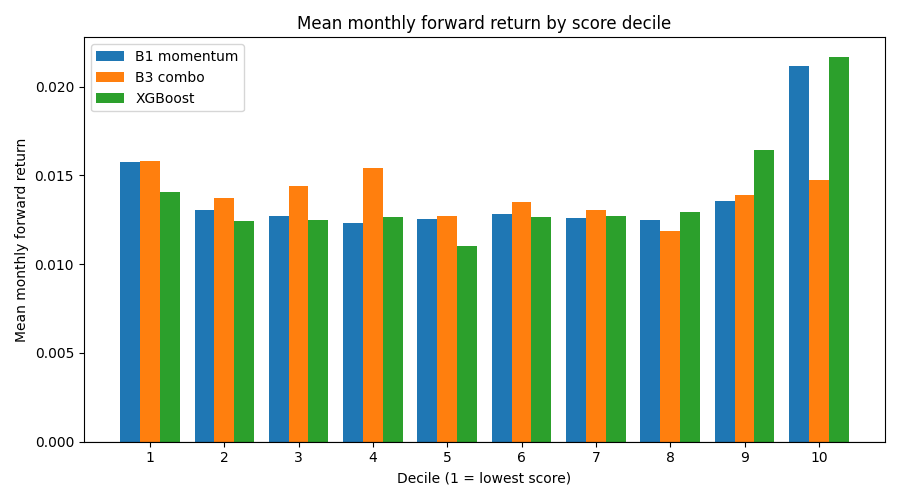

# ML Signal Generator

Two studies under the same rules: baselines before ML, walk-forward with no
leakage, error bars or t-stats on every headline number, costs charged on
turnover, and negative results reported as findings.

Phase 1 asked whether daily OHLC technicals can time SPY day to day. They
cannot: test AUC is indistinguishable from a coin flip and the long-only signal
loses to buy-and-hold. Phase 2 changes the question to one where the academic
prior is not flat: rank the S&P 500 cross-section each month and predict
relative next-month returns. There the walk-forward models do clear the
pre-registered significance bar (XGBoost gross long-short Newey-West t = 3.47
over 149 months), but on a survivorship-biased universe that inflates exactly
this kind of result, so it reads as an upper bound, not a discovery.

---

## Phase 1: timing SPY (negative result)

All phase 1 numbers are the console output of `python main.py` on the default
configuration (SPY, 2020-01-01 to 2024-01-01, threshold 0.55, 2 bps cost).

**Test window: 2023-05-31 to 2023-12-29 (148 rows, 147 backtest days).**

| | Total Return | Sharpe | Max DD | Days Long |
|---|---|---|---|---|
| Random Forest (selected) | 7.32% | 1.56 | -4.97% | 57.1% |
| XGBoost | 3.04% | 0.62 | -8.47% | 62.6% |
| **Buy & Hold SPY** | **13.96%** | **2.20** | -9.97% | 100.0% |

Excess return vs buy & hold: Random Forest -6.64pp, XGBoost -10.91pp. The
strategy is long most days of a melt-up, so it captures a fraction of the
market's beta and reports it as performance. A long-only signal in a rising
market earns beta, not alpha.

```
Bootstrap 95% CI on test AUC (2000 resamples):
  Random Forest   AUC 0.5255   95% CI [0.4269, 0.6235]   contains 0.5 - cannot reject coin flip
  XGBoost         AUC 0.5462   95% CI [0.4516, 0.6451]   contains 0.5 - cannot reject coin flip

WALK-FORWARD VALIDATION (expanding window, 5 folds)
  Random Forest  - mean AUC: 0.4997
  XGBoost        - mean AUC: 0.4903
```

Both walk-forward AUCs are at or below 0.5: no edge detected. The full phase 1
write-up (overfitting diagnostic, stationary-feature fix, harness design)
remains reproducible with `python main.py`.

Phase 1 is the motivation for phase 2. Timing one liquid index with technicals
is the hardest version of the question. Ranking a large cross-section on
standard characteristics is the easier, better-posed one: a long-short
portfolio has no structural beta to hide behind, and the monthly horizon gives
non-overlapping observations. Non-overlapping is not the same as independent,
which is why every t-stat below is Newey-West.

## Phase 2: cross-sectional ranking

Question: do standard cross-sectional features (momentum, reversal,
volatility, 52-week high, liquidity) predict *relative* next-month returns
across the S&P 500? All phase 2 numbers are the output of
`python -m src.cross_sectional.run` (run 2026-07-17, data downloaded
2026-07-17) and live in `outputs/cross_sectional_results.json`.

**Universe.** The 503 current S&P 500 members, fetched once from Wikipedia and
committed to `data/universe_sp500.csv` so every rerun uses the identical list.
All 503 downloaded successfully (2010-01-01 to 2026-07-17, raw unadjusted daily
bars, cached locally). This is TODAY'S index applied retroactively to 2010,
which is a survivorship-biased design; the caveats section spells out the
direction of that bias, and it matters for reading every number below.

**Data.** All returns (features and the forward-return target) come from
adjusted-close ratios, while dollar volume and the 52-week-high feature come
from the split-adjusted-only close times volume, because Yahoo folds dividends
into past prices and that distortion is cross-sectional and correlated with
dividend yield, the dimension a ranking sorts on.

**Panel.** Rebalance on the last trading day of each calendar month; the final
calendar month is always dropped so every forward return spans one complete
month. A name enters a month once it has 253 trading days of history and all
six features; a month needs at least 100 eligible names. Result: 186 months,
2011-01-31 to 2026-06-30, 87,160 name-months, 421 to 499 names per month
(mean 469). Features are rank-transformed to [0, 1] within each month, so no
scaler is ever fitted and nothing can leak across time by construction. The
ML target is the within-month percentile of the forward return: the models
learn relative ordering, not market direction.

**Features.** `mom_12_1` (12-1 momentum), `rev_1m` (short-term reversal),
`vol_63d` (annualized 63-day volatility), `dist_52w_high` (distance to the
52-week high), `amihud_63d` (Amihud illiquidity), `log_dollar_vol_63d` (size
and liquidity proxy; market caps are not available from the batch download,
and this is the honest substitute).

**Baselines first.** B1: momentum rank. B2: negative-reversal rank. B3: an
equal-weight sum of all six feature ranks with signs fixed by the academic
prior, no fitting. B3 sees exactly the features the models see; if ML cannot
beat it, ML adds nothing here.

**Walk-forward protocol.** Expanding window, 36-month burn-in, refit every 12
months. When predicting month t, training uses only samples whose
forward-return window closed by t (embargo: sample month <= t - 1). Models:
linear regression, XGBoost (300 trees, depth 4), Random Forest (300 trees,
depth 8). Every method, including the no-fit baselines and the benchmark, is
evaluated on the identical window: 2014-01-31 to 2026-05-29, 149 months.

**Pre-registered headline test**, fixed before any result was seen: the
Newey-West t-stat on the mean monthly GROSS XGBoost D10-minus-D1 long-short
return over the common window. The net-of-cost table is the economic qualifier
on that result. Every other number in this study is descriptive. With several
methods examined, the conventional t = 2 hurdle is optimistic; Harvey, Liu and
Zhu argue t near 3 for new factor claims.

### Results

The pre-registered test passes at face value: XGBoost gross long-short
Newey-West t = 3.47 (lag 4). Face value is the problem, and the caveats below
are not decoration. Two honest observations up front. First, the classic
single-factor baselines are flat in this sample: every no-fit baseline has a
mean IC under 0.01 with a t-stat under 1, and B3's long-short return is
negative. The fitted models beat B3 decisively, so the value came from fitting
the weights, not from the academic priors. Second, plain linear regression
posts the highest mean IC of all six methods (0.027), so most of what the
trees add over a fitted linear model is portfolio concentration, not rank
accuracy.

Monthly Spearman rank IC between score and next-month return:

| Method | Mean IC | NW t-stat | % positive months |
|---|---|---|---|
| B1 momentum | 0.0054 | 0.39 | 54% |
| B2 reversal | 0.0053 | 0.43 | 49% |
| B3 combo | 0.0081 | 0.64 | 58% |
| Linear | 0.0271 | 2.64 | 54% |
| XGBoost | 0.0183 | 2.63 | 56% |
| Random Forest | 0.0255 | 3.05 | 59% |

Mean monthly forward return by score decile (the spread lives in the top
decile, and B1's D1 shows the loser-bounce pattern that makes shorting past
losers expensive):



D10-minus-D1 long-short, equal weight within legs, rebalanced monthly, gross.
Monthly arithmetic returns; annualized return is 12x the mean, vol is
sqrt(12)x, Sharpe uses rf = 0; max drawdown is the largest peak-to-trough
decline of the arithmetic cumsum. Turnover is mean one-way traded notional per
leg per month, weight-based with drift, and the first month's full entry is
charged:

| Method | Ann return | Ann vol | Sharpe | Max DD | NW t | Turnover L/S | D10-EW (monthly) | NW t |
|---|---|---|---|---|---|---|---|---|
| B1 momentum | +6.5% | 20.1% | 0.32 | -42.4% | 1.12 | 0.30 / 0.31 | +0.73% | 2.45 |
| B2 reversal | -2.2% | 17.7% | -0.13 | -88.0% | -0.48 | 0.87 / 0.86 | +0.12% | 0.54 |
| B3 combo | -1.3% | 16.6% | -0.08 | -76.2% | -0.31 | 0.37 / 0.40 | +0.08% | 0.63 |
| Linear | +12.2% | 14.8% | 0.82 | -18.0% | 3.38 | 0.56 / 0.56 | +0.75% | 3.84 |
| XGBoost | +9.1% | 11.5% | 0.79 | -12.6% | 3.47 | 0.60 / 0.72 | +0.78% | 4.62 |
| Random Forest | +14.1% | 12.5% | 1.13 | -12.1% | 5.19 | 0.48 / 0.65 | +0.92% | 4.97 |
| Equal-weight universe (gross) | +16.7% | 15.7% | 1.07 | | | | | |

The equal-weight universe row is the long-only "own everything" alternative.
It is NOT the comparator for the roughly beta-neutral long-short, which is
tested against zero; it is the comparator for the long leg, via the D10-EW
column. That an equal-weight basket of today's survivors returned 16.7% a year
gross at Sharpe 1.07 is itself a measure of how favorable this sample is.

Net long-short at per-side costs on traded notional,
`net_t = gross_t - c * (TN_long_t + TN_short_t)`:

| Method | 0 bps | 5 bps | 10 bps | 20 bps |
|---|---|---|---|---|
| B1 momentum | +6.5% / 0.32 | +5.8% / 0.29 | +5.0% / 0.25 | +3.6% / 0.18 |
| B2 reversal | -2.2% / -0.13 | -4.3% / -0.24 | -6.4% / -0.36 | -10.5% / -0.60 |
| B3 combo | -1.3% / -0.08 | -2.3% / -0.14 | -3.2% / -0.19 | -5.1% / -0.31 |
| Linear | +12.2% / 0.82 | +10.8% / 0.73 | +9.5% / 0.64 | +6.8% / 0.46 |
| XGBoost | +9.1% / 0.79 | +7.6% / 0.66 | +6.0% / 0.52 | +2.8% / 0.25 |
| Random Forest | +14.1% / 1.13 | +12.7% / 1.02 | +11.3% / 0.91 | +8.6% / 0.69 |

(Cells are annualized return / Sharpe.) The XGBoost signal survives 10 bps and
is largely gone at the 20 bps stress level; Random Forest, with lower
turnover, degrades more slowly.

### Phase 2 caveats

**Survivorship bias, the big one.** The universe is today's S&P 500 members
applied retroactively to 2010. Firms that were delisted, acquired at
distressed prices, or dropped from the index along the way are absent; firms
that grew into the index are present for their whole pre-inclusion rise. The
bias inflates results, and it inflates the LONG side and momentum-style
signals in particular: names that survived into the current index
disproportionately had strong past returns, so a portfolio that buys past
winners inside this universe is graded on a sample already filtered for
winning. Losers that kept losing until they disappeared are exactly the names
the short side would have profited from, and they are missing. Any positive
long-side or momentum result here is therefore an upper bound, and a null
result would be *more* believable, not less, because the deck was stacked in
the signal's favor. A secondary version of the same filter: names enter the
panel only once they have 13 months of price history, so current members with
post-2010 listings appear mid-sample (ABNB's first bar is 2020-12-10, GEV's
2024-03-27), again a selection for success. The cross-section grows over the
sample: 421 names in the thinnest month against a mean of 469.

**Costs are optimistic.** 5-10 bps per side is a reasonable range for
large-cap US names at retail-to-small-institutional size. Short borrow fees,
financing, and within-month execution slippage are not modeled, so the net
long-short figures are upper bounds. Monthly close-to-close accounting also
assumes execution at the closing price of the rebalance day.

**No market caps.** Portfolios are equal-weight and the size proxy is dollar
volume, because market caps are not available from the batch download. A
cap-weighted version could look materially different.

**One universe, one period.** 149 evaluation months of one index in a mostly
rising US market. And with six methods in the tables, the multiple-testing
caution above applies to every number: the pre-registered XGBoost t = 3.47
clears the Harvey-Liu-Zhu bar nominally, but it does so on a stacked deck.

## Reproduce

```bash
pip install -r requirements.txt
python main.py                        # phase 1: SPY timing study
python -m src.cross_sectional.run     # phase 2: full study; downloads and caches prices on first run
python -m pytest tests/               # unit tests (or: python tests/run_tests.py)
```

Phase 2 flags: `--refresh` wipes the price cache and redownloads,
`--models lin,xgb,rf`, `--costs 0,5,10,20`, `--start 2010-01-01`. The
committed universe file is frozen; `python -m src.cross_sectional.universe
--force` re-fetches it from Wikipedia. Prices are cached in `data/` after the
first download, so reruns are offline and deterministic given the cache. The
default invocation reproduces every phase 2 number above; it wrote
`outputs/cross_sectional_results.json` and `outputs/xsec_decile_returns.png`
in 122.7s on a laptop from the local cache (recorded as `elapsed_seconds`
in the results JSON).

## Project structure

```
ml-signal-generator/
|-- main.py                       # phase 1 CLI entry point
|-- data/
|   `-- universe_sp500.csv        # committed frozen universe (price cache is gitignored)
|-- src/
|   |-- features.py               # phase 1 feature engineering
|   |-- model.py                  # phase 1 training and validation
|   |-- backtest.py               # phase 1 backtest and benchmark
|   `-- cross_sectional/
|       |-- universe.py           # one-time Wikipedia fetch
|       |-- data.py               # chunked yfinance download and CSV cache
|       |-- features.py           # monthly panel, features, rank transforms
|       |-- baselines.py          # B1 momentum, B2 reversal, B3 combo
|       |-- models.py             # walk-forward linear / XGBoost / Random Forest
|       |-- evaluate.py           # IC, NW t-stats, deciles, turnover, costs
|       |-- plots.py              # decile chart
|       `-- run.py                # phase 2 entry point
|-- tests/                        # leakage, feature, and evaluation tests
|-- notebooks/
|   `-- 01_training.ipynb
|-- outputs/
|   |-- cross_sectional_results.json
|   `-- xsec_decile_returns.png
`-- requirements.txt
```

## Disclaimer

**For educational purposes only, not financial advice.** These are not trading
recommendations. Past performance does not guarantee future results.

## License

See LICENSE file for details.

## Author

GasparCoquet
